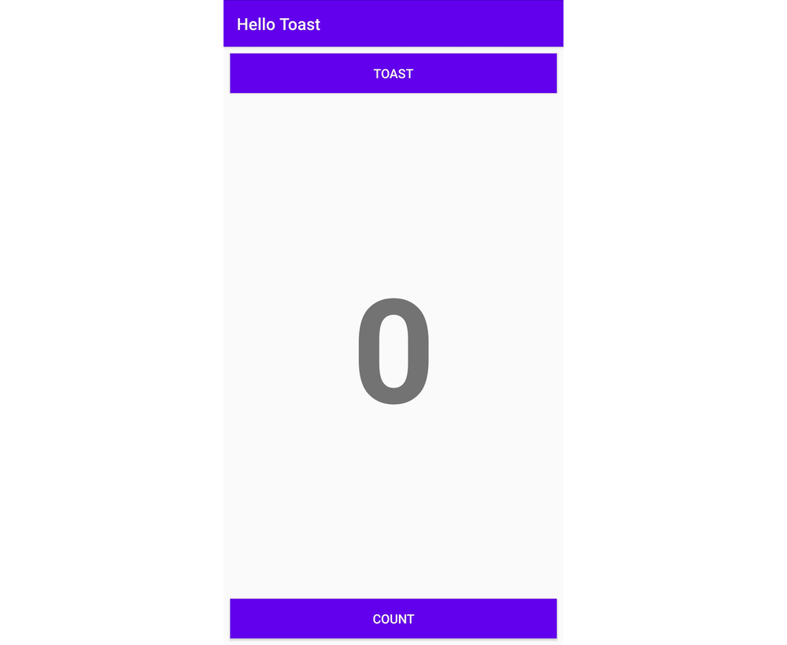
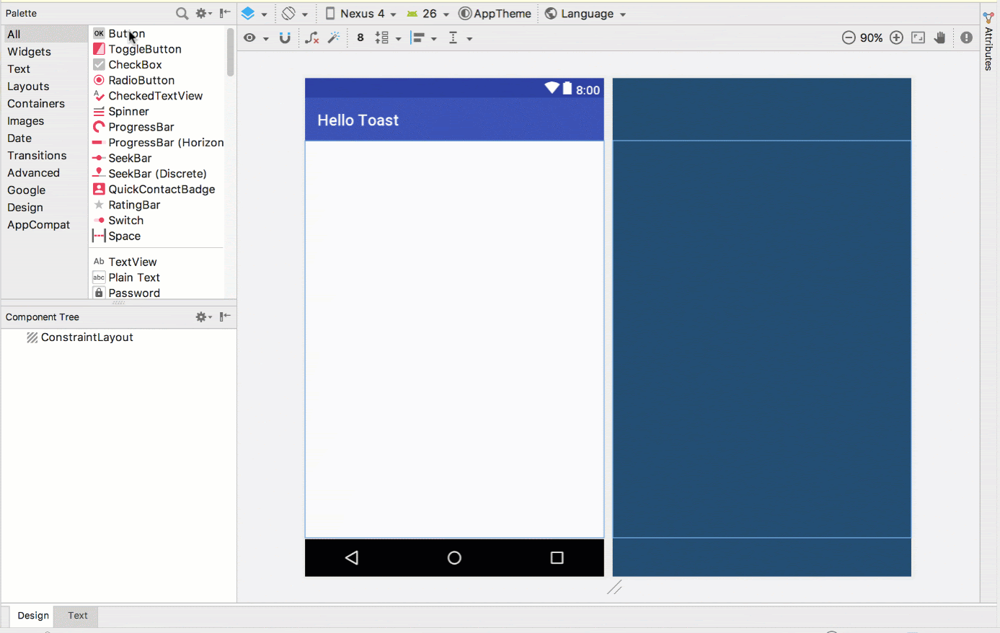
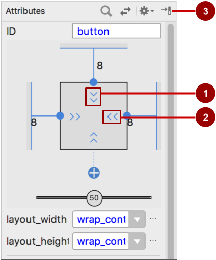

# Yor First interactive UI

This sub-project is the "first-android" app for those who have never been programming Android in Java. As you go through
the steps below, you set your venture to Android App to a jump start! 

In addition, this app also incorporates [checkstyle](./config/checkstyle/checkstyle.xml) as
[a dependent Gradle `build` task](./app/build.gradle)

## App Overview

The HelloToast app consists of two ``Button`` elements and one ``TextView``. When the user taps the first Button, it
displays a short message (a [Toast](https://developer.android.com/reference/android/widget/Toast.html)) on the screen.
Tapping the second ``Button`` increases a "click" counter displayed in the ``TextView``, which starts at zero. 

Here's what the finished app looks like:



## Task 1: Create and explore a new project

### 1.1 Create the Android Studio project

Start Android Studio and create a new project with the following parameters:

| Attribute                    | Value              |
|------------------------------|--------------------|
| Application Name             | Hello Toast        |
| Company Name                 | com.github.qubitpi |
| Phone and Tablet Minimum SDK | API17              |
| Template                     | Empty Activity     |
| Generate Layout file box     | Selected           |
| Backwards Compatibility box  | Selected           |

Select **Run > Run app** or click the **Run icon**  in the toolbar to build and
execute the app on the emulator or your device. 

### 1.2 Explore the layout editor

Android Studio provides the layout editor for quickly building an app's layout of user interface (UI) elements. It lets
you drag elements to a visual design and blueprint view, position them in the layout, add constraints, and set
attributes. *Constraints* determine the position of a UI element within the layout. A constraint represents a connection
or alignment to another view, the parent layout, or an invisible guideline.

Explore the layout editor, and refer to the figure below as you follow the numbered steps: 


1. In the **app > res > layout** folder in the **Project > Android** pane, double-click the **activity_main.xml** file
   to open it, if it is not already open. 
2. Click the **Design** tab if it is not already selected. You use the **Design** tab to manipulate elements and the
   layout, and the Text tab to edit the XML code for the layout.
3. The **Palettes** pane shows UI elements that you can use in your app's layout.
4. The **Component** tree pane shows the view hierarchy of UI elements. ``View`` elements are organized into a tree
   hierarchy of parents and children, in which a child inherits the attributes of its parent. In the figure above, the
   ``TextView`` is a child of the
   [``ConstraintLayout``](https://developer.android.com/reference/android/support/constraint/ConstraintLayout.html).
5. The design and blueprint panes of the layout editor showing the UI elements in the layout. In the figure above, the
   layout shows only one element: a TextView that displays "Hello World".
6. The **Attributes** tab displays the **Attributes** pane for setting properties for a UI element.

## Task 2: Add View elements in the layout editor

In this task you create the UI layout for the HelloToast app in the layout editor using the
[``ConstraintLayout``](https://developer.android.com/reference/android/support/constraint/ConstraintLayout.html)
features. You can create the constraints manually, as shown later, or automatically using the 
**Autoconnect** tool. 

### 2.1 Examine the element constraints

Follow these steps:

1. Open ``activity_main.xml`` from the **Project > Android** pane if it is not already open. If the
   **Design** tab is not already selected, click it. If there is no blueprint, click the
   **Select Design Surface** button 
   in the toolbar and choose **Design + Blueprint**

2. The **Autoconnect** tool  is also located in the
   toolbar. It is enabled by default. For this step, ensure that the tool is not disabled. 

3. Click the zoom in button to zoom into the design and blueprint
   panes for a close-up look.

4. Select **TextView** in the Component Tree pane. The "Hello World" ``TextView`` is highlighted in
   the design and blueprint panes and the constraints for the element are visible. 

5. Refer to the animated figure below for this step. Click the circular handle on the right side of
   the ``TextView`` to delete the horizontal constraint that binds the view to the right side of the
   layout. The ``TextView`` jumps to the left side because it is no longer constrained to the right
   side. To add back the horizontal constraint, click the same handle and drag a line to the right
   side of the layout.


In the blueprint or design panes, the following handles appear on the ``TextView`` element:

* **Constraint handle**: To create a constraint as shown in the animated figure above, click a
  constraint handle, shown as a circle on the side of an element. Then drag the handle to another
  constraint handle, or to a parent boundary. A zigzag line represents the constraint. 

    

* **Resizing handle**: To resize the element, drag the square resizing handles. The handle changes
  to an angled corner while you are dragging it. 

    

### 2.2 Add a Button to the layout

When enabled, the **Autoconnect** tool automatically creates two or more constraints for a UI
element to the parent layout. After you drag the element to the layout, it creates constraints based
on the element's position. 

Follow these steps to add a ``Button``:

1. Start with a clean slate. The ``TextView`` element is not needed, so while it is still selected,
   press the ``Delete`` key or choose **Edit > Delete**. You now have a completely blank layout.
2. Drag a **Button** from the **Palette** pane to any position in the layout. If you drop the
   ``Button`` in the top middle area of the layout, constraints may automatically appear. If not,
   you can drag constraints to the top, left side, and right side of the layout as shown in the
   animated figure below.

    
    
### 2.3 Add a second Button to the layout

1. Drag another **Button** from the **Palette** pane to the middle of the layout as shown in the
   animated figure below. Autoconnect may provide the horizontal constraints for you (if not, you
   can drag them yourself). 

2. Drag a vertical constraint to the bottom of the layout (refer to the figure below).

    
    
You can remove constraints from an element by selecting the element and hovering your pointer over
it to show the Clear Constraints button
. Click this button to remove
all constraints on the selected element. To clear a single constraint, click the specific handle
that sets the constraint. 

To clear all constraints in the entire layout, click the **Clear All Constraints** tool in the
toolbar. This tool is useful if you want to redo all the constraints in your layout.

## Task 3: Change UI element attributes

The **Attributes** pane offers access to all of the XML attributes you can assign to a UI element.
You can find the attributes (known as *properties*) common to all views in the
[View class documentation](https://developer.android.com/reference/android/view/View.html).

In this task you enter new values and change values for important ``Button`` attributes, which are
applicable to most View types. 

### 3.1 Change the Button size

***The layout editor offers resizing handles on all four corners of a ``View`` so you can resize the
``View`` quickly. You can drag the handles on each corner of the ``View`` to resize it, but doing so
hardcodes the width and height dimensions. Avoid hardcoding sizes for most ``View`` elements,
because hardcoded dimensions can't adapt to different content and screen sizes***. 

Instead, use the **Attributes** pane on the right side of the layout editor to select a sizing mode
that doesn't use hardcoded dimensions. The **Attributes** pane includes a square sizing panel called
the *view inspector* at the top. The symbols inside the square represent the height and width
settings as follows:



In the figure above:

1. Select the top ``Button`` in the **Component Tree** pane.
2. Click the **Attributes** tab on the right side of the layout editor window.

    
    
3. Click the width control twice - the first click changes it to **Fixed** with straight lines; the
   second click changes it to **Match Constraints** with spring coils, as shown in the animated
   figure below.

    
    
    As a result of changing the width control, the ``layout_width`` attribute in the **Attributes**
    pane shows the value ``match_constraint`` and the ``Button`` element stretches horizontally to
    fill the space between the left and right sides of the layout.

4. Select the second ``Button``, and make the same changes to the ``layout_width`` as in the
   previous step, as shown in the figure below.

    
    
As shown in the previous steps, the ``layout_width`` and ``layout_height`` attributes in the
**Attributes** pane change as you change the height and width controls in the inspector. These
attributes can take one of three values for the layout, which is a ``ConstraintLayout``:

* The ``match_constraint`` setting expands the ``View`` element to fill its parent by width or
  height - up to a margin, if one is set. The parent in this case is the ``ConstraintLayout``. You
  learn more about ConstraintLayout in the next task.

* The ``wrap_content`` setting shrinks the ``View`` element's dimensions so it is just big enough to
  enclose its content. If there is no content, the ``View`` element becomes invisible.

* To specify a fixed size that adjusts for the screen size of the device, use a fixed number of
  [density-independent pixels](https://developer.android.com/training/multiscreen/screendensities.html)
  (``dp`` units). For example, ``16dp`` means 16 density-independent pixels.

**Tip**: If you change the ``layout_width`` attribute using its popup menu, the ``layout_width``
attribute is set to zero because there is no set dimension. This setting is the same as
``match_constraint`` - the view can expand as much as possible to meet constraints and margin
settings.

### 3.2 Change the Button attributes

To identify each ``View`` uniquely within an ``Activity`` layout, each ``View`` or ``View`` subclass
 (such as ``Button``) needs a unique ID. And to be of any use, the ``Button`` elements need text.
``View`` elements can also have backgrounds that can be colors or images.

The **Attributes** pane offers access to all of the attributes you can assign to a ``View`` element.
You can enter values for each attribute, such as the ``android:id``, ``background``, ``textColor``,
and ``text`` attributes. 

The following animated figure demonstrates how to perform these steps:

1. After selecting the first ``Button``, edit the ``ID`` field at the top of the **Attributes** pane
   to **button_toast** for the ``android:id`` attribute, which is used to identify the element in
   the layout.
2. Set the ``background`` attribute to **@color/colorPrimary**. (As you enter **@c**, choices appear
   for easy selection.)
3. Set the ``textColor`` attribute to **@android:color/white**.
4. Edit the ``text`` attribute to **Toast**.

    
    
5. Perform the same attribute changes for the second ``Button``, using **button_count** as the ID,
   **Count** for the **text** attribute, and the same colors for the background and text as the
   previous steps.

The ``colorPrimary`` is the primary color of the theme, one of the predefined theme base colors
defined in the ``colors.xml`` resource file. It is used for the app bar. Using the base colors for
other UI elements creates a uniform UI.

## Task 4: Add a TextEdit and set its attributes

One of the benefits of
[``ConstraintLayout``](https://developer.android.com/reference/android/support/constraint/ConstraintLayout.html)
is the ability to align or otherwise constrain elements relative to other elements. In this task you
will add a ``TextView`` in the middle of the layout, and constrain it horizontally to the margins
and vertically to the two ``Button`` elements. You will then change the attributes for the
``TextView`` in the **Attributes** pane. 

### 4.1 Add a TextView and constraints

1. As shown in the animated figure below, drag a ``TextView`` from the **Palette** pane to the upper
   part of the layout, and drag a constraint from the top of the ``TextView`` to the handle on the
   bottom of the **Toast** ``Button``. This constrains the ``TextView`` to be underneath the
   ``Button``.

    
    
2. As shown in the animated figure below, drag a constraint from the bottom of the ``TextView`` to
   the handle on the top of the **Count** ``Button``, and from the sides of the ``TextView`` to the
   sides of the layout. This constrains the ``TextView`` to be in the middle of the layout between
   the two ``Button`` elements.

    
    
### 4.2 Set the TextView attributes

With the ``TextView`` selected, open the **Attributes** pane, if it is not already open. Set
attributes for the ``TextView`` as shown specified below:

1. Set the ``ID`` to **show_count**.
2. Set the ``text`` to **0**.
3. Set the ``textSize`` to **160sp**.
4. Set the ``textStyle`` to **B** (bold) and the textAlignment to ``ALIGNCENTER`` (center the
   paragraph). If textAlignment is missing, In Android Studio, open **build.gradle (Module: app)**; Look for
   **minSdkVersion**; Changing this to 17; clear cache and restart Android Studio. For more info, follow this link
   https://stackoverflow.com/a/54538284
5. Change the horizontal and vertical view size controls (``layout_width`` and ``layout_height``) to
   **match_constraint**.
6. Set the ``textColor`` to **@color/colorPrimary**.
7. Scroll down the pane and click **View all attributes**, scroll down the second page of attributes
   to ``background``, and then enter **#FFFFFF** for a shade of yellow.

* ``textSize``: The text size of the ``TextView``. For this lesson, the size is set to ``160sp``. The ``sp`` stands for
_scale-independent_ pixel, and like ``dp``, is a unit that scales with the screen density and user's font size
preference. Use dp units when you specify font sizes so that the sizes are adjusted for both the screen density and the
user's preference.
* ``textStyle`` and ``textAlignment``: The text style, set to **B** (bold) in this lesson, and the text alignment, set
to ``ALIGNCENTER`` (center the paragraph).

You may notice that the ``background`` attribute is on the first page of the **Attributes** pane for a ``Button``, but
on the second page of the **Attributes** pane for a ``TextView``. The **Attributes** pane changes for each type of
``View``: The most popular attributes for the ``View`` type appear on the first page, and the rest are listed on the
second page. 

### Task 5: Edit the layout in XML

The Hello Toast app layout is nearly finished! However, an exclamation point appears next to each UI element in the
Component Tree. Hover your pointer over these exclamation points to see warning messages, as shown below. The same
warning appears for all three elements: hardcoded strings should use resources. 


The easiest way to fix layout problems is to edit the layout in XML. While the layout editor is a powerful tool, some
changes are easier to make directly in the XML source code.

## 5.1 Open the XML code for the layout

For this task, open the ``activity_main.xml`` file if it is not already open, and click the **Code** tab (XML editing).

The XML editor appears, replacing the design and blueprint panes. As you can see in the figure below, which shows part
of the XML code for the layout, the warnings are highlighted - the hardcoded strings "Toast" and "Count". (The hardcoded
"0" is also highlighted but not shown in the figure.) Hover your pointer over the hardcoded string "Toast" to see the
warning message.


### 5.2 Extract string resources

***Instead of hard-coding strings, it is a best practice to use string resources, which represent the strings. Having
the strings in a separate file makes it easier to manage them, especially if you use these strings more than once. Also,
string resources are mandatory for translating and localizing your app, because you need to create a string resource
file for each language.***


1. Click once on the word "``Toast``"(the first highlighted warning).
2. Press **Alt-Enter** in Windows or **Option-Enter** in macOS and choose **Extract string resource** from the popup
   menu.
3. Enter **button_label_toast** for the **Resource name**.
4. Click **OK**. A string resource is created in the ``values/res/strings.xml`` file, and the string in your code is
   replaced with a reference to the resource: ``@string/button_label_toast``
5. Extract the remaining strings: ``button_label_count`` for "``Count``", and ``count_initial_value`` for "``0``".
6. In the **Project > Android pane**, expand **values** within **res**, and then double-click **strings.xml** to see
   your string resources in the ``strings.xml`` file:
   
   ```xml
    <resources>
        <string name="app_name">Hello Toast</string>
        <string name="button_label_toast">Toast</string>
        <string name="button_label_count">Count</string>
        <string name="count_initial_value">0</string>
    </resources>
    ```
7. You need another string to use in a subsequent task that displays a message. Add to the ``strings.xml`` file another
   string resource named ``toast_message`` for the phrase "Hello Toast!":
   
   ```xml
    <resources>
        <string name="app_name">Hello Toast</string>
        <string name="button_label_toast">Toast</string>
        <string name="button_label_count">Count</string>
        <string name="count_initial_value">0</string>
        <string name="toast_message">Hello Toast!</string>
    </resources>
    ```
**Tip**: The string resources include the app name, which appears in the app bar at the top of the screen if you start
your app project using the Empty Template. You can change the app name by editing the ``app_name`` resource.

## Task 6: Add onClick handlers for the buttons

In this task, you add a Java method for each ``Button`` in ``MainActivity`` that executes when the user taps the
``Button``. 

### 6.1 Add the onClick attribute and handler to each Button

A _click handler_ is a method that is invoked when the user clicks or taps on a clickable UI element. In Android Studio
you can specify the name of the method in the ``onClick`` field in the **Design** tab's **Attributes** pane. You can
also specify the name of the handler method in the XML editor by adding the ``android:onClick`` property to the
``Button``. You will use the latter method because you haven't yet created the handler methods, and the XML editor
provides an automatic way to create those methods.

1. With the XML editor open (the Text tab), find the ``Button`` with the ``android:id`` set to ``button_toast``:

   ```xml
   <Button
           android:id="@+id/button_toast"
           android:layout_width="0dp"
           ...
           app:layout_constraintStart_toStartOf="parent"
           app:layout_constraintTop_toTopOf="parent" />
   ```
2. Add the ``android:onClick`` attribute to the end of the ``button_toast`` element after the last attribute and before
   the ``/>`` end indicator:
   
   ```xml
    android:onClick="showToast" />
   ```
3. Click the red bulb icon that appears next to attribute. Select **Create click handler**, choose **MainActivity**, and
   click **OK**. If the red bulb icon doesn't appear, click the method name ("``showToast``"). Press **Alt-Enter**
   (**Option-Enter** on the Mac), select **Create 'showToast(view)' in MainActivity**, and click **OK**. This action
   creates a placeholder method stub for the ``showToast()`` method in ``MainActivity``, as shown at the end of these
   steps.
4. Repeat the last two steps with the ``button_count`` ``Button``: Add the ``android:onClick`` attribute to the end, and
   add the click handler:
   
   ```xml
   android:onClick="countUp" />
   ```
   
   The XML code for the UI elements within the ConstraintLayout now looks like this:
   
   ```xml
   <Button
           android:id="@+id/button_toast"
           android:layout_width="0dp"
           android:layout_height="wrap_content"
           android:layout_marginEnd="8dp"
           android:layout_marginStart="8dp"
           android:layout_marginTop="8dp"
           android:background="@color/colorPrimary"
           android:text="@string/button_label_toast"
           android:textColor="@android:color/white"
           app:layout_constraintEnd_toEndOf="parent"
           app:layout_constraintStart_toStartOf="parent"
           app:layout_constraintTop_toTopOf="parent"
           android:onClick="showToast"/>
   
       <Button
           android:id="@+id/button_count"
           android:layout_width="0dp"
           android:layout_height="wrap_content"
           android:layout_marginBottom="8dp"
           android:layout_marginEnd="8dp"
           android:layout_marginStart="8dp"
           android:background="@color/colorPrimary"
           android:text="@string/button_label_count"
           android:textColor="@android:color/white"
           app:layout_constraintBottom_toBottomOf="parent"
           app:layout_constraintEnd_toEndOf="parent"
           app:layout_constraintStart_toStartOf="parent"
           android:onClick="countUp" />
   
       <TextView
           android:id="@+id/show_count"
           android:layout_width="0dp"
           android:layout_height="0dp"
           android:layout_marginBottom="8dp"
           android:layout_marginEnd="8dp"
           android:layout_marginStart="8dp"
           android:layout_marginTop="8dp"
           android:background="#FFFF00"
           android:text="@string/count_initial_value"
           android:textAlignment="center"
           android:textColor="@color/colorPrimary"
           android:textSize="160sp"
           android:textStyle="bold"
           app:layout_constraintBottom_toTopOf="@+id/button_count"
           app:layout_constraintEnd_toEndOf="parent"
           app:layout_constraintStart_toStartOf="parent"
           app:layout_constraintTop_toBottomOf="@+id/button_toast" />
   ```
5. If ``MainActivity.java`` is not already open, expand java in the **Project > Android** view, expand
   ``com.github.qubitpi.hellotoast``, and then double-click ``MainActivity``. The code editor appears with the code in
   ``MainActivity``. Modify the code so that it looks like the one shown
   [here](./app/src/main/java/com/github/qubitpi/hellotoast/MainActivity.java)
